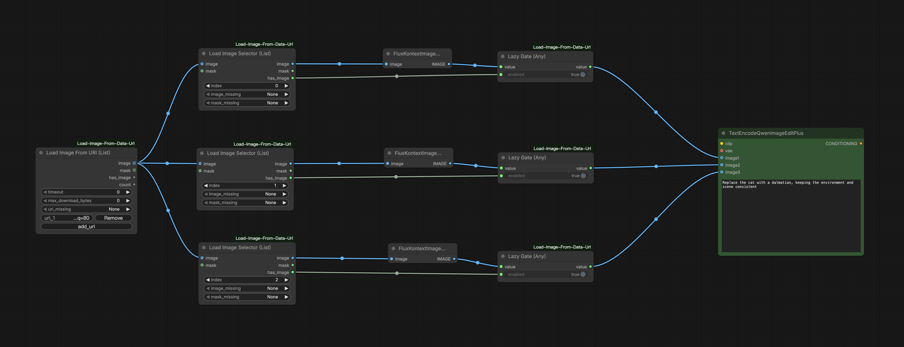

# ComfyUI Load Image From Data URL

[中文文档](./README.zh-CN.md)

Open-source ComfyUI custom nodes for loading images from URLs, local paths, and S3, plus simple batch loading and batch selection.

The batch loader uses independent URI fields that can be added with a `+ Add URI` button. It does not split a single string by commas or newlines, so data URLs can contain arbitrary payload text safely.

## Included Nodes

- `Load Image From URI` (`LoadImageFromURI`)
- `Load Image From URI (Batch)` (`LoadImageFromURIBatch`)
- `Load Image From URI (List)` (`LoadImageFromURIList`)
- `Load Image Selector (Batch)` (`LoadImageSelectorBatch`)
- `Load Image Selector (List)` (`LoadImageSelectorList`)
- `Lazy Gate (Any)` (`LazyGateAny`)
- `Preview Image (With None)` (`PreviewImageWithNone`)

## Install

```bash
cd ComfyUI/custom_nodes
git clone https://github.com/qq1014853731/ComfyUI-Load-Image-From-Data-Url.git
```

Install dependencies in the same Python environment used by ComfyUI:

```bash
pip install -r requirements.txt
```

Restart ComfyUI after installation.

After updating this node, refresh the browser page as well so ComfyUI loads the frontend extension for the batch `+ Add URI` button.

## What You Can Input

- `data:` URL
- `http://` / `https://` / `ftp://`
- `s3://bucket/key`
- `file://`
- local file path
- Windows drive path such as `C:\\example.png`
- relative path such as `./input/example.png`

Relative paths are resolved from the current working directory of the ComfyUI process.

## Node Usage

### Load Image From URI

Use this node when you want to load **one image**.

- `uri`: image address or path
- `timeout`: request timeout in seconds, `0` means no explicit timeout
- `max_download_bytes`: maximum download size in bytes, `0` means no explicit limit
- `uri_missing`: how to handle an empty URI
  - `None`: return `None` for image/mask
  - `Placeholder`: return a ComfyUI-compatible empty tensor
  - `Throw error`: stop with an error

Best for:

- loading one remote image
- loading one local image
- loading one S3 image

### Load Image From URI (Batch)

Use this node when you want to load **multiple images as one batch tensor**.

- Click `+ Add URI` to add one independent URI/path field per image
- Other parameters are the same as the single-image node
- Empty URI items use `uri_missing`; `None` skips that item in batch output, `Placeholder` keeps its position with an empty tensor, and `Throw error` stops.
- `size_mode`:
  - `pad_to_max`: output one batch tensor by padding smaller images/masks to the largest width and height
  - `resize_to_first`: output one batch tensor by resizing later images/masks to the first image size
  - `error`: stop when any image size differs

Best for:

- sending multiple images into nodes that support batch input
- forcing a single batch tensor output

### Load Image From URI (List)

Use this node when you want to load **multiple images while preserving each original resolution**.

- Click `+ Add URI` to add one independent URI/path field per image
- Outputs a ComfyUI list of individual `IMAGE` / `MASK` tensors
- Does not resize or pad images
- Empty URI items use `uri_missing`; `None` outputs `None` for that list item, `Placeholder` outputs an empty tensor, and `Throw error` stops.

### Load Image Selector (Batch)

Use this node after `Load Image From URI (Batch)` when you want to pick **one image** from a batch tensor.

- `index`: which image to pick
  - `0` = first image
  - `1` = second image
  - `-1` = last image
- `image_missing`: how to handle a missing selected image
- `mask_missing`: how to handle a missing selected mask
  - `None`: return `None` for that output
  - `Placeholder`: return a ComfyUI-compatible empty tensor for that output
  - `Throw error`: stop with an error
- `image` and `mask` are optional and handled independently.
- Out-of-range `index` is treated as missing for both `image` and `mask`.

Best for:

- selecting one image from a loaded batch tensor
- building optional or index-based workflows

### Load Image Selector (List)

Use this node after `Load Image From URI (List)` when you want to pick **one image** from a ComfyUI image list while keeping the selected image's original resolution.

Inputs match `Load Image Selector (Batch)`, but this node consumes the full list at once and selects by list index.

### Lazy Gate (Any)

Use this node when you want to conditionally bypass an upstream branch and output `None` without forcing that branch to execute.

- `enabled`:
  - `true`: request the lazy input `value` and pass it through
  - `false`: do not request `value`; output `None` directly
- `value`:
  - accepts any ComfyUI type (`*`)
  - marked as lazy input, so it is only evaluated when `enabled = true`

Best for:

- skipping nodes that do not accept `None`
- forwarding `None` to downstream nodes that can accept optional inputs
- building conditional branches where disabled paths should not execute

### Preview Image (With None)

Use this node like ComfyUI's preview node, but it safely accepts `None`.

- Input `image` is optional.
- When `image` is `None`, this node does nothing and does not raise an error.
- When `image` is present, it behaves like normal preview and shows/saves preview images.

Best for:
- optional image branches
- workflows where some branches intentionally output `None`

## Simple Examples

### Lazy Gate workflow example



### Single image

```text
https://example.com/image.png
```

```text
s3://my-bucket/path/to/image.png
```

```text
./input/example.png
```

### Batch image list

Use the `+ Add URI` button and put each value in its own URI field. Each URI field has its own `Remove` button, and remaining fields are renumbered continuously after deletion.

## S3 Notes

S3 uses `boto3` and AWS default credentials. You can also use environment variables such as:

```bash
AWS_ENDPOINT_URL=http://127.0.0.1:9000
AWS_DEFAULT_REGION=us-east-1
AWS_ACCESS_KEY_ID=minioadmin
AWS_SECRET_ACCESS_KEY=minioadmin
AWS_SESSION_TOKEN=...
```

`AWS_ENDPOINT_URL` is useful for MinIO or other S3-compatible services.

## License

MIT. See [LICENSE](./LICENSE).